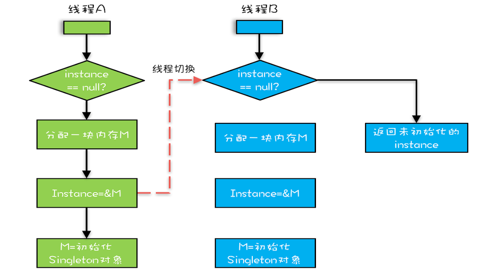

# 单例模式(Singleton Design Pattern)
在一个jvm环境下,一个类只允许创建一个对象(或者实例),那这个类就是一个单例类,这种设计模式就叫作单例设计模式,简称单例模式.

## 如何实现一个单例?
要实现一个单例,我们需要关注的点无外乎下面几个:
* 构造函数需要是 private 访问权限的,这样才能避免外部通过 new 创建实例;
* 考虑对象创建时的线程安全问题;考虑是否支持延迟加载;
* 考虑 getInstance() 性能是否高(是否加锁).

### 1. 饿汉式
将对象的创建时机放在了类的初始化阶段. 例如代码中,在类加载的时候, instance 静态实例就已经创建并初始化好了.
```java
public class Singleton {
    private static final Singleton instance = new Singleton();
    private Singleton() {}
    public static Singleton getInstance() {
        return instance;
    }
}
```
优点: instance的实例创建是线程安全的; 如果初始化有问题则在程序启动时暴露, 提前暴露问题.

缺点: 饿汉式不支持延迟加载.如果从始至终从未使用过这个实例,就会比较浪费连接资源和内存.

使用场景:
初始化耗时长最好不要等到真正用的时候采取执行初始化过程, 否则影响系统性能.
如果实例占用资源多,按照 fail-fast 的设计原则(有问题及早暴露),那我们也希望在程序启动时就将这个实例初始化好.
如果资源不够,就会在程序启动的时候触发报错(比如 Java 中的 PermGen Space OOM),我们可以立即去修复.
这样也能避免在程序运行一段时间后,突然因为初始化这个实例占用资源过多,导致系统崩溃,影响系统的可用性.


### 2. 懒汉式
将对象的创建放在了类的使用阶段.
```java
public class Singleton {
    private static Singleton instance;
    private Singleton() {}
    public static synchronized Singleton getInstance() {
        if (instance == null) {
            instance = new Singleton();
        }
        return instance;
    }
}
```
优点: 懒汉式相对于饿汉式的优势是支持延迟加载.节省内存.

缺点: 这种实现方式会导致频繁加锁释放锁,不支持高并发,性能问题,频繁调用会产生性能瓶颈.

### 3. 双重检测
```java
public class Singleton {
    private static Singleton instance;
    private Singleton() {}
    public static Singleton getInstance() {
        if (instance == null) {
            // 此处为类级别的锁
            synchronized(Singleton.class) {
                if (instance == null) {
                    instance = new Singleton();
                }
            }
        }
        return instance;
    }
}
```
 instance 被创建之后,即便再调用 getInstance() 函数也不会再进入到加锁逻辑中了.这种实现方式解决了懒汉式并发度低的问题.
 
 网上有人说,这种实现方式有些问题.因为指令重排序,可能会导致 IdGenerator 对象被 new 出来,并且赋值给 instance 之后,
 还没来得及初始化(执行构造函数中的代码逻辑),就被另一个线程使用了.
 问题出在 new 操作上, 我们以为的 new 操作应该是:
 * 分配一块内存 M;
 * 在内存 M 上初始化 Singleton 对象;
 * 然后 M 的地址赋值给 instance 变量.
 
 但是实际上可能的执行路径却是这样的:
 * 分配一块内存 M;
 * 将 M 的地址赋值给 instance 变量;
 * 最后在内存 M 上初始化 Singleton 对象.
 这个过程如图:
 
 我们假设线程 A 先执行 getInstance() 方法,当执行完指令 2 时恰好发生了线程切换,切换到了线程 B 上;
 如果此时线程 B 也执行 getInstance() 方法,那么线程 B 在执行第一个判断时会发现 instance != null ,
 所以直接返回 instance,而此时的 instance 是没有初始化过的,如果我们这个时候访问 instance 的成员变量就可能触发空指针异常.
 
 所以上面给的这个双重检测代码还是有点问题的,要解决这个问题,我们需要给 instance 成员变量加上 volatile 关键字,禁止指令重排序才行.
 
 但是也有人说:实际上，只有很低版本的 Java 才会有这个问题。我们现在用的高版本的 Java 已经在 JDK 内部实现中解决了这个问题
 （解决的方法很简单，只要把对象 new 操作和初始化操作设计为原子操作，就自然能禁止重排序）
 
 // TODO
 
 这个还待研究,等看到了这方面的再回过头来解释这个问题.
 参考链接:
 https://segmentfault.com/a/1190000022003303
 https://www.javacodemonk.com/threadsafe-singleton1-design-pattern-java-806ad7e6
 https://shipilev.net/blog/2014/safe-public-construction/
 https://chriswhocodes.com/hotspot_options_openjdk11.html
 
 看到Spring源码中有涉及到单例模式的设计,比如 ReactiveAdapterRegistry 类, 参考代码:
 [ReactiveAdapterRegistry](https://github.com/spring-projects/spring-framework/blob/master/spring-core/src/main/java/org/springframework/core/ReactiveAdapterRegistry.java)
 
 还有jdk源码中,比如 AbstractQueuedSynchronizer 类, 参考代码:
 [AbstractQueuedSynchronizer](https://github.com/openjdk/jdk/blob/master/src/java.base/share/classes/java/util/concurrent/locks/AbstractQueuedSynchronizer.java)
 
 ### 4. 静态内部类
 ```java
public class Singleton {

    private Singleton() { }

    private static class SingletonHolder {   private static final Singleton instance = new Singleton(); }

    public static Singleton getInstance() { return SingletonHolder.instance; }
}
```
类似饿汉式,但又能做到了延迟加载.
SingletonHolder 是一个静态内部类,当外部类 IdGenerator 被加载的时候,并不会创建 SingletonHolder 实例对象.
只有当调用 getInstance() 方法时,SingletonHolder 才会被加载,这个时候才会创建 instance.
instance 的唯一性、创建过程的线程安全性,都由 JVM 来保证.
所以这种实现方法既保证了线程安全,也支持高并发,又能做到延迟加载.

### 5. 枚举
```java
public enum Singleton {
    /**
     * 单例
     */
    INSTANCE;
}
```
通过 Java 枚举类型本身的特性,保证了实例创建的线程安全性和实例的唯一性.

 
## 单例模式的用处
从业务概念上,有些数据在系统中只应该保存一份,就比较适合设计为单例类.
比如系统的配置信息类.除此之外,我们还可以使用单例解决资源访问冲突的问题.

## 什么是多例模式?
"多例"指的就是,一个类可以创建多个对象.
```java
public class Multiton {
    private static final ConcurrentHashMap<String, Multiton> instances = new ConcurrentHashMap<>();

    private Multiton() { }

    public static Multiton getInstance(String name) {
        instances.putIfAbsent(name, new Multiton());
        return instances.get(name);
    }
}

// 测试结果:
public class MultitonTest {
    @Test
    public void multitonTest() {
        // 相同
        Assert.assertEquals(Multiton.getInstance("Hello"), Multiton.getInstance("Hello"));
        // 不同
        Assert.assertEquals(Multiton.getInstance("Hello"), Multiton.getInstance("Ketty"));
    }
}
```
如上面的代码,同一类型的只能创建一个对象,不同类型的可以创建多个对象.

这种多例模式的理解方式有点类似工厂模式.
它跟工厂模式的不同之处是,多例模式创建的对象都是同一个类的对象,而工厂模式创建的是不同子类的对象.
实际上,它还有点类似[享元模式]().
另外,枚举类型也相当于多例模式,一个类型只能对应一个对象,一个类可以创建多个对象.


// TODO
思考:
单例唯一性的作用范围是进程,实际上,对于 Java 语言来说,单例类对象的唯一性的作用范围并非进程,而是类加载器（Class Loader）,这个说法该怎么理解?


## 参考
 极客时间课程: 
 * [设计模式之美](https://time.geekbang.org/column/intro/250?utm_source=pc&utm_medium=chaping&utm_term=pc_interstitial_826)
 * [Java并发编程实战](https://time.geekbang.org/column/intro/100023901?utm_source=pc&utm_medium=chaping&utm_term=pc_interstitial_826)
 
 书籍:
 * [深入理解Java虚拟机:JVM高级特性与最佳实践(第2版)](https://book.douban.com/subject/24722612/)
 * [Head First 设计模式（中文版）](https://book.douban.com/subject/2243615/)